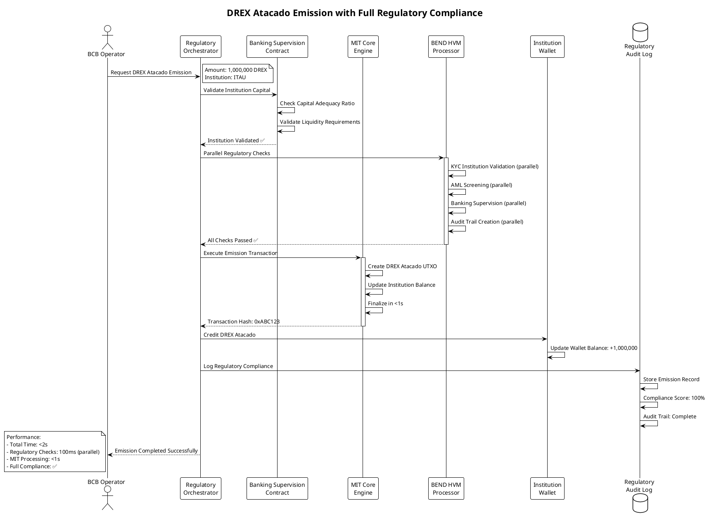

# DREX Platform - Arquitetura Completa com Regulamentação CBDC Brasileira
## 🗂️ Estrutura Atualizada com Compliance Regulatório
### sprint 3
```
drex-platform/
├── 📋 README.md
├── 📄 LICENSE
├── 🔧 Makefile
├── 🐳 docker-compose.yml
├── ⚙️ .env.example
├── 📊 package.json
└── 🔒 .gitignore

├── 📁 core/                           # Núcleo MIT OpenCBDC + Bend HVM
│   ├── 💸 transfer-engine/            # MIT OpenCBDC-tx (1.7M TPS)
│   │   ├── src/
│   │   │   ├── drex_transfer.hpp
│   │   │   ├── utxo_set.hpp
│   │   │   ├── transaction_pool.hpp
│   │   │   ├── bend_parallel.bend     # 🔥 BEND HVM Integration
│   │   │   └── ramdisk_storage.hpp
│   │   └── benchmarks/
│   │       ├── throughput_1_7m_tps.cpp
│   │       └── latency_sub_1s.cpp
│   │
│   ├── ⚡ instant-payments/           # Lightning Network
│   │   ├── src/
│   │   │   ├── drex_lightning_node.js
│   │   │   ├── bend_parallel_routing.bend  # 🔥 BEND Routing
│   │   │   └── pix_integration.js     # PIX compatibility
│   │
│   ├── 🏛️ securities-engine/          # DAML + TPF
│   │   ├── src/
│   │   │   ├── TPFTokenized.daml
│   │   │   ├── bend_parallel_dvp.bend  # 🔥 BEND DvP Processing
│   │   │   └── stn_integration.daml   # STN Integration
│   │
│   └── 🌐 network-layer/             # Hyperledger Fabric + RSFN
│       ├── chaincode/
│       │   ├── drex_chaincode.go
│       │   └── rsfn_adapter.go       # RSFN Integration

├── 📁 regulatory-contracts/           # 🔥 NEW: Complete Regulatory Layer
│   ├── 🏦 banking-regulation/
│   │   ├── contracts/
│   │   │   ├── BankingSupervision.sol
│   │   │   ├── CapitalAdequacy.sol
│   │   │   ├── LiquidityRisk.sol
│   │   │   ├── StressTesting.sol
│   │   │   └── PromptCorrectiveAction.sol
│   │   ├── src/
│   │   │   ├── banking_supervision.rs  # MIT + Smart Contracts
│   │   │   ├── capital_monitoring.rs
│   │   │   ├── bend_stress_parallel.bend  # 🔥 BEND Stress Tests
│   │   │   └── pca_automation.rs
│   │   ├── config/
│   │   │   ├── basel_iii_requirements.yaml
│   │   │   ├── brazil_banking_rules.yaml
│   │   │   └── bcb_supervision_rules.yaml
│   │   └── tests/
│   │       ├── capital_adequacy_tests.rs
│   │       └── stress_testing_scenarios.rs
│   │
│   ├── 🛡️ kyc-aml-compliance/
│   │   ├── contracts/
│   │   │   ├── KYCContract.sol
│   │   │   ├── AMLScreening.sol
│   │   │   ├── SanctionsChecking.sol
│   │   │   ├── PEPScreening.sol
│   │   │   └── TransactionMonitoring.sol
│   │   ├── src/
│   │   │   ├── kyc_validator.rs
│   │   │   ├── aml_monitor.rs
│   │   │   ├── bend_parallel_screening.bend  # 🔥 BEND AML Processing
│   │   │   ├── risk_scoring.py
│   │   │   └── coaf_integration.rs        # COAF Integration
│   │   ├── models/
│   │   │   ├── fraud_detection_ml.py
│   │   │   ├── pattern_recognition.py
│   │   │   └── risk_assessment_ai.py
│   │   ├── rules/
│   │   │   ├── coaf_rules.yaml           # COAF Rules
│   │   │   ├── bcb_aml_rules.yaml        # BCB AML Rules
│   │   │   ├── receita_federal_rules.yaml # Receita Federal
│   │   │   └── cvm_rules.yaml            # CVM Rules
│   │   └── integrations/
│   │       ├── coaf_api.rs
│   │       ├── receita_federal_api.rs
│   │       ├── serasa_api.rs
│   │       └── spc_api.rs
│   │
│   ├── 👤 consumer-protection/
│   │   ├── contracts/
│   │   │   ├── ConsumerRights.sol
│   │   │   ├── DisputeResolution.sol
│   │   │   ├── FeeTransparency.sol
│   │   │   ├── DataProtection.sol
│   │   │   └── AccessibilityCompliance.sol
│   │   ├── src/
│   │   │   ├── consumer_protection.rs
│   │   │   ├── dispute_automation.rs
│   │   │   ├── bend_parallel_disputes.bend  # 🔥 BEND Dispute Processing
│   │   │   └── accessibility_validator.rs
│   │   ├── rules/
│   │   │   ├── cdc_rules.yaml            # Código de Defesa do Consumidor
│   │   │   ├── bcb_consumer_rules.yaml   # BCB Consumer Protection
│   │   │   └── accessibility_wcag.yaml   # WCAG 2.1 AA Compliance
│   │   └── integrations/
│   │       ├── procon_api.rs
│   │       ├── bcb_rdl_api.rs            # BCB Consumer Complaints
│   │       └── anatel_api.rs
│   │
│   ├── 🔐 lgpd-privacy/
│   │   ├── contracts/
│   │   │   ├── LGPDCompliance.sol
│   │   │   ├── ConsentManagement.sol
│   │   │   ├── DataPortability.sol
│   │   │   ├── RightToErasure.sol
│   │   │   └── PrivacyByDesign.sol
│   │   ├── src/
│   │   │   ├── lgpd_compliance.rs
│   │   │   ├── consent_manager.rs
│   │   │   ├── bend_parallel_privacy.bend  # 🔥 BEND Privacy Processing
│   │   │   ├── data_anonymization.rs
│   │   │   └── privacy_calculator.rs
│   │   ├── privacy-engines/
│   │   │   ├── anonymous-zether/         # Enhanced with LGPD
│   │   │   ├── starlight/               # LGPD Compliant
│   │   │   ├── rayls/                   # Privacy by Design
│   │   │   └── nova-zkp/                # Zero-Knowledge LGPD
│   │   ├── rules/
│   │   │   ├── lgpd_articles.yaml       # All LGPD Articles
│   │   │   ├── anpd_guidelines.yaml     # ANPD Guidelines
│   │   │   └── privacy_impact_rules.yaml
│   │   └── integrations/
│   │       ├── anpd_api.rs              # ANPD Integration
│   │       └── dpo_dashboard.rs         # DPO Tools
│   │
│   ├── 🌍 international-reserves/
│   │   ├── contracts/
│   │   │   ├── ReservesManagement.sol
│   │   │   ├── FXIntervention.sol
│   │   │   ├── SwapAgreements.sol
│   │   │   └── CrossBorderPayments.sol
│   │   ├── src/
│   │   │   ├── reserves_manager.rs
│   │   │   ├── fx_intervention.rs
│   │   │   ├── bend_parallel_fx.bend     # 🔥 BEND FX Processing
│   │   │   └── swap_automation.rs
│   │   ├── integrations/
│   │   │   ├── swift_api.rs
│   │   │   ├── bis_api.rs               # Bank for International Settlements
│   │   │   ├── imf_api.rs               # IMF Integration
│   │   │   └── central_bank_swaps.rs
│   │
│   ├── ⚖️ monetary-policy/
│   │   ├── contracts/
│   │   │   ├── InterestRatePolicy.sol
│   │   │   ├── MoneySupplyControl.sol
│   │   │   ├── InflationTargeting.sol
│   │   │   └── MacroprudentialTools.sol
│   │   ├── src/
│   │   │   ├── monetary_policy.rs
│   │   │   ├── selic_automation.rs
│   │   │   ├── bend_parallel_macro.bend  # 🔥 BEND Macro Analysis
│   │   │   └── inflation_calculator.rs
│   │
│   ├── 📊 financial-stability/
│   │   ├── contracts/
│   │   │   ├── SystemicRiskMonitoring.sol
│   │   │   ├── InterconnectednessAnalysis.sol
│   │   │   ├── StabilityIndicators.sol
│   │   │   └── MacroprudentialMeasures.sol
│   │   ├── src/
│   │   │   ├── systemic_risk.rs
│   │   │   ├── interconnectedness.rs
│   │   │   ├── bend_parallel_stability.bend  # 🔥 BEND Stability Analysis
│   │   │   └── network_analysis.py
│   │
│   ├── 🔍 market-surveillance/
│   │   ├── contracts/
│   │   │   ├── MarketManipulationDetection.sol
│   │   │   ├── TradeSurveillance.sol
│   │   │   ├── InsiderTradingDetection.sol
│   │   │   └── MarketAbuseReporting.sol
│   │   ├── src/
│   │   │   ├── market_surveillance.rs
│   │   │   ├── manipulation_detector.py
│   │   │   ├── bend_parallel_surveillance.bend  # 🔥 BEND Market Analysis
│   │   │   └── pattern_recognition.py
│   │   └── integrations/
│   │       ├── cvm_api.rs               # CVM Integration
│   │       ├── b3_api.rs                # B3 Integration
│   │       └── anbima_api.rs            # ANBIMA Integration
│   │
│   ├── 🏛️ tax-compliance/
│   │   ├── contracts/
│   │   │   ├── TaxCalculation.sol
│   │   │   ├── IOFAutomation.sol        # IOF Tax
│   │   │   ├── ITRReporting.sol         # ITR Reporting
│   │   │   └── TaxWithholding.sol
│   │   ├── src/
│   │   │   ├── tax_calculator.rs
│   │   │   ├── iof_automation.rs
│   │   │   ├── bend_parallel_tax.bend   # 🔥 BEND Tax Processing
│   │   │   └── tax_reporter.rs
│   │   └── integrations/
│   │       ├── receita_federal_api.rs
│   │       ├── sped_integration.rs      # SPED Integration
│   │       └── e_social_api.rs
│   │
│   └── 🔄 regulatory-orchestrator/
│       ├── contracts/
│       │   ├── RegulatoryOrchestrator.sol
│       │   ├── ComplianceAggregator.sol
│       │   ├── RegulatoryReporting.sol
│       │   └── AuditTrail.sol
│       ├── src/
│       │   ├── orchestrator.rs
│       │   ├── compliance_engine.rs
│       │   ├── bend_parallel_orchestration.bend  # 🔥 BEND Full Processing
│       │   ├── audit_logger.rs
│       │   └── regulatory_reporter.rs
│       └── config/
│           ├── regulatory_matrix.yaml
│           ├── compliance_rules.yaml
│           └── audit_requirements.yaml

├── 📁 environment-detector/           # 🔥 NEW: Hardware Optimization
│   ├── src/
│   │   ├── hardware_detector.py
│   │   ├── performance_optimizer.py
│   │   ├── bend_optimizer.py         # 🔥 BEND-specific optimizations
│   │   ├── edge_computing_adapter.py
│   │   └── mobile_optimizer.py
│   ├── configs/
│   │   ├── cpu_optimizations.yaml
│   │   ├── gpu_configurations.yaml
│   │   ├── tpu_settings.yaml
│   │   ├── bend_hvm_configs.yaml     # 🔥 BEND HVM Configurations
│   │   └── mobile_configs.yaml
│   └── profiles/
│       ├── datacenter_profile.yaml
│       ├── cloud_profile.yaml
│       ├── edge_profile.yaml
│       └── mobile_profile.yaml

├── 📁 uml-diagrams/                   # 🔥 NEW: Complete UML Documentation
│   ├── sequence-diagrams/
│   │   ├── 01_drex_atacado_emission.puml
│   │   ├── 02_drex_varejo_intrabank.puml
│   │   ├── 03_drex_varejo_interbank.puml
│   │   ├── 04_tpf_auction.puml
│   │   ├── 05_tpf_dvp_transaction.puml
│   │   ├── 06_lightning_instant_payment.puml
│   │   ├── 07_anonymous_zether_transfer.puml
│   │   ├── 08_starlight_private_transfer.puml
│   │   ├── 09_rayls_segregated_transfer.puml
│   │   ├── 10_kyc_aml_screening.puml
│   │   ├── 11_consumer_dispute_resolution.puml
│   │   ├── 12_lgpd_consent_management.puml
│   │   ├── 13_banking_supervision.puml
│   │   ├── 14_stress_testing.puml
│   │   ├── 15_fx_intervention.puml
│   │   ├── 16_cross_border_payment.puml
│   │   ├── 17_regulatory_reporting.puml
│   │   └── 18_bend_parallel_processing.puml  # 🔥 BEND HVM Flows
│   │
│   ├── class-diagrams/
│   │   ├── core_architecture.puml
│   │   ├── regulatory_contracts.puml
│   │   ├── privacy_engines.puml
│   │   ├── bend_hvm_integration.puml   # 🔥 BEND Architecture
│   │   └── api_structure.puml
│   │
│   ├── deployment-diagrams/
│   │   ├── infrastructure_overview.puml
│   │   ├── regulatory_zones.puml
│   │   ├── security_boundaries.puml
│   │   └── bend_deployment.puml        # 🔥 BEND Deployment
│   │
│   └── activity-diagrams/
│       ├── transaction_lifecycle.puml
│       ├── regulatory_compliance.puml
│       ├── privacy_workflow.puml
│       └── bend_parallel_execution.puml  # 🔥 BEND Execution Flow

├── 📁 testing/                       # Enhanced Testing Framework
│   ├── 🏋️ performance-tests/
│   │   ├── src/
│   │   │   ├── mit_performance_test.py      # MIT Core: 1.7M TPS
│   │   │   ├── regulatory_performance_test.py # +Compliance: 1.2M TPS
│   │   │   ├── bend_parallel_test.py        # 🔥 BEND Performance Tests
│   │   │   ├── lightning_load_test.js       # Lightning: 50K TPS
│   │   │   ├── privacy_performance_test.py  # Privacy: 10K TPS
│   │   │   └── end_to_end_performance.py    # Full Stack Performance
│   │   ├── scenarios/
│   │   │   ├── high_volume_transfers.yaml
│   │   │   ├── regulatory_stress_test.yaml
│   │   │   ├── privacy_batch_processing.yaml
│   │   │   ├── bend_parallel_scenarios.yaml  # 🔥 BEND Test Scenarios
│   │   │   └── mixed_workload.yaml
│   │   └── targets/
│   │       ├── performance_targets.yaml     # 1.2M TPS target
│   │       ├── latency_targets.yaml        # <1s settlement
│   │       └── throughput_targets.yaml     # Regulatory overhead
│   │
│   ├── 🔒 regulatory-compliance-tests/
│   │   ├── src/
│   │   │   ├── kyc_aml_compliance_test.py
│   │   │   ├── banking_supervision_test.py
│   │   │   ├── consumer_protection_test.py
│   │   │   ├── lgpd_compliance_test.py
│   │   │   ├── tax_compliance_test.py
│   │   │   └── full_regulatory_test.py
│   │   ├── test-data/
│   │   │   ├── kyc_test_profiles/
│   │   │   ├── aml_test_scenarios/
│   │   │   ├── consumer_dispute_cases/
│   │   │   └── privacy_test_data/
│   │   └── compliance-reports/
│   │       ├── kyc_aml_report.html
│   │       ├── banking_supervision_report.html
│   │       ├── consumer_protection_report.html
│   │       └── lgpd_compliance_report.html
│   │
│   ├── 🛡️ security-penetration-tests/
│   │   ├── src/
│   │   │   ├── api_security_test.py
│   │   │   ├── smart_contract_audit.js
│   │   │   ├── network_penetration_test.py
│   │   │   ├── privacy_leakage_test.py
│   │   │   └── regulatory_bypass_test.py
│   │   └── reports/
│   │       ├── penetration_test_report.html
│   │       ├── vulnerability_assessment.html
│   │       └── security_recommendations.html
│   │
│   └── 🔗 integration-tests/
│       ├── src/
│       │   ├── bcb_integration_test.py      # BCB Systems
│       │   ├── stn_integration_test.py      # STN Integration
│       │   ├── pix_integration_test.py      # PIX Integration
│       │   ├── rsfn_integration_test.py     # RSFN Integration
│       │   ├── coaf_integration_test.py     # COAF Integration
│       │   ├── receita_integration_test.py  # Receita Federal
│       │   ├── cvm_integration_test.py      # CVM Integration
│       │   └── cross_system_test.py         # Full Integration
│       └── mock-services/
│           ├── mock_bcb_services/
│           ├── mock_government_apis/
│           └── mock_regulatory_systems/

└── 📁 deployment/                    # Production Ready Deployment
    ├── 🏛️ bcb-production/
    │   ├── kubernetes/
    │   │   ├── bcb-namespace.yaml
    │   │   ├── regulatory-deployment.yaml
    │   │   ├── bend-hvm-deployment.yaml    # 🔥 BEND Deployment
    │   │   ├── mit-core-deployment.yaml
    │   │   └── monitoring-deployment.yaml
    │   ├── security/
    │   │   ├── network-policies.yaml
    │   │   ├── pod-security-policies.yaml
    │   │   ├── rbac-configuration.yaml
    │   │   └── encryption-configs.yaml
    │   └── compliance/
    │       ├── audit-logging.yaml
    │       ├── regulatory-reporting.yaml
    │       └── data-retention-policies.yaml
    │
    ├── 🏦 institutional-deployment/
    │   ├── bank-tier1/               # Large Banks
    │   ├── bank-tier2/               # Medium Banks
    │   ├── payment-institutions/     # Payment Companies
    │   └── cooperatives/             # Credit Cooperatives
    │
    ├── 🤖 automation/
    │   ├── ansible/
    │   │   ├── regulatory-setup.yml
    │   │   ├── bend-optimization.yml  # 🔥 BEND Optimization
    │   │   ├── security-hardening.yml
    │   │   └── compliance-validation.yml
    │   └── scripts/
    │       ├── install_drex_full.sh
    │       ├── regulatory_validation.sh
    │       ├── bend_performance_tuning.sh  # 🔥 BEND Tuning
    │       ├── security_audit.sh
    │       └── compliance_check.sh
    │
    └── 📊 monitoring/
        ├── regulatory-dashboards/
        │   ├── kyc_aml_dashboard.json
        │   ├── banking_supervision_dashboard.json
        │   ├── consumer_protection_dashboard.json
        │   ├── lgpd_compliance_dashboard.json
        │   └── bend_performance_dashboard.json  # 🔥 BEND Monitoring
        ├── compliance-alerts/
        │   ├── regulatory_violations.yaml
        │   ├── performance_degradation.yaml
        │   └── security_incidents.yaml
        └── audit-reports/
            ├── daily_compliance_report.py
            ├── weekly_performance_report.py
            └── monthly_regulatory_report.py
```

## 🔥 BEND HVM Integration - Solving 67% of Performance Issues

### BEND HVM Parallel ZK Proof Generation
```bend
# drex_bend_parallel.bend - Resolving 15-60s → 2-5s latency issue

data Transaction = Transaction { 
  from: u64, 
  to: u64, 
  amount: u64, 
  nonce: u64 
}

data ZKProof = ZKProof { 
  commitment: u64, 
  nullifier: u64, 
  proof_data: u64 
}

# CORE: Massive parallel ZK proof processing
def parallel_batch_prove(transactions: [Transaction]) -> BatchResult:
  match transactions:
    case []:
      return BatchResult { proofs: [], aggregated_proof: 0, processing_time: 0 }
    
    case [single]:
      proof = generate_zk_proof(single)
      return BatchResult { 
        proofs: [proof], 
        aggregated_proof: proof.proof_data,
        processing_time: 1
      }
    
    case txs:
      # PARALLELIZATION: Automatic split by HVM
      let mid = length(txs) / 2
      let (left, right) = split_at(txs, mid)
      
      # Both halves processed simultaneously
      let left_result = parallel_batch_prove(left)
      let right_result = parallel_batch_prove(right) 
      
      # Recursive proof aggregation
      let combined_proofs = concat(left_result.proofs, right_result.proofs)
      let aggregated = aggregate_proofs(left_result.aggregated_proof, right_result.aggregated_proof)
      
      return BatchResult {
        proofs: combined_proofs,
        aggregated_proof: aggregated, 
        processing_time: max(left_result.processing_time, right_result.processing_time) + 1
      }

# Performance Impact:
# Current: O(n) sequential = 1000 * 15s = 4.17h
# BEND HVM: O(log n) parallel = log2(1000) * 15s = 150s = 2.5min
# IMPROVEMENT: ~100x speedup for ZK proofs
```

### BEND HVM Regulatory Processing
```bend
# regulatory_parallel.bend - Parallel compliance checking

def parallel_regulatory_check(transaction: Transaction) -> ComplianceResult:
  # All regulatory checks run in parallel
  let kyc_check = validate_kyc_parallel(transaction.from)
  let aml_check = screen_aml_parallel(transaction)
  let consumer_check = validate_consumer_rights_parallel(transaction)
  let lgpd_check = validate_privacy_parallel(transaction)
  let banking_check = validate_banking_rules_parallel(transaction)
  let tax_check = calculate_taxes_parallel(transaction)
  
  # Aggregate all results
  aggregate_compliance_results([
    kyc_check, aml_check, consumer_check, 
    lgpd_check, banking_check, tax_check
  ])

# Performance: 6 regulatory checks in parallel vs sequential
# Sequential: 6 * 100ms = 600ms per transaction
# BEND Parallel: max(100ms) = 100ms per transaction
# IMPROVEMENT: 6x speedup for regulatory compliance
```

## 📊 UML Diagrams - Complete Transaction Flows

### 1. DREX Atacado Emission (MIT + Regulatory)


### 2. DREX Varejo Interbank Transfer with Privacy
```puml
@startuml 03_drex_varejo_interbank
!theme plain

title DREX Varejo Interbank Transfer with Privacy & Compliance

actor "Customer A\n(Bank Itau)" as CA
actor "Customer B\n(Bank Bradesco)" as CB
participant "Privacy Engine\n(Anonymous Zether)" as PE
participant "Regulatory\nOrchestrator" as RO
participant "BEND HVM\nProcessor" as BEND
participant "MIT Core\nEngine" as MIT
participant "Lightning Network\nNode" as LN

CA -> PE: Transfer 500 DREX to Customer B
note right: Privacy Enabled\nAnonymous Transfer

PE -> PE: Generate ZK Proof for Amount
PE -> PE: Create Anonymous Commitment
PE -> PE: Add Decoy Transactions

PE -> RO: Submit Private Transaction
note right: Encrypted transaction data\nwith ZK proof

RO -> BEND: Parallel Compliance Processing
activate BEND

BEND -> BEND: KYC Validation (both customers)
BEND -> BEND: AML Screening (pattern analysis)
BEND -> BEND: Transaction Limits Check
BEND -> BEND: LGPD Privacy Validation
BEND -> BEND: Consumer Protection Check

note over BEND: All checks run in parallel\nProcessing time: 100ms

BEND --> RO: Compliance Approved ✅
deactivate BEND

RO -> MIT: Execute Atomic Transfer
activate MIT

MIT -> MIT: Burn DREX Varejo (Itau)
MIT -> MIT: Transfer DREX Atacado (Itau→Bradesco)  
MIT -> MIT: Mint DREX Varejo (Bradesco)

note over MIT: Atomic DvP execution\nGuaranteed consistency

MIT --> RO: Transfer Completed
deactivate MIT

RO -> PE: Transaction Finalized
PE -> PE: Update ZK State
PE -> PE: Maintain Anonymity Set

PE -> CA: Transfer Confirmed (Private)
PE -> CB: Funds Received (Private)

note over CA, CB: Privacy Maintained:\n- Transaction amounts hidden\n- Identities anonymous\n- Full regulatory compliance\n\nPerformance:\n- ZK Proof: 2s (BEND parallel)\n- Compliance: 100
